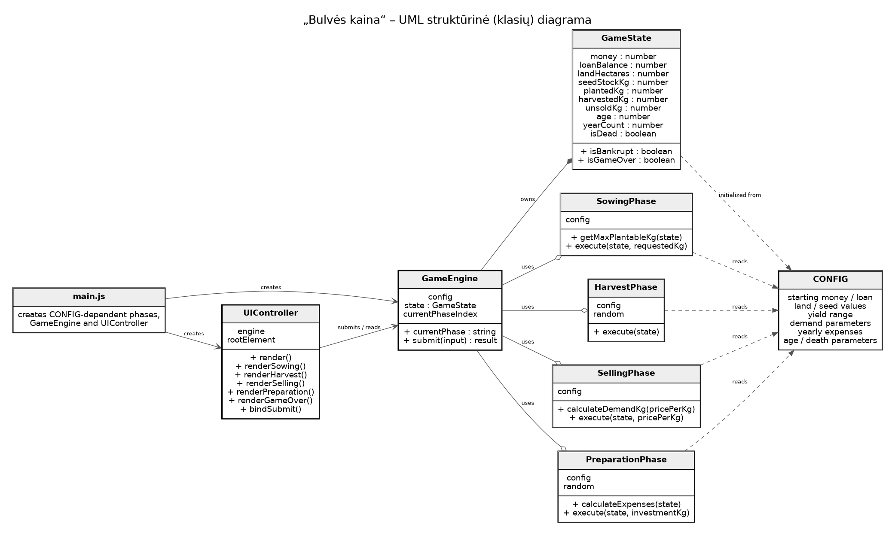
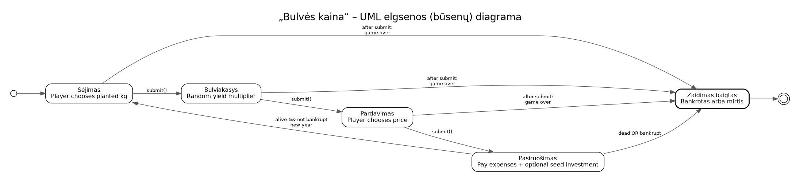

# [Žaisti](https://ugnius-p.github.io/bulves-kaina/)

## Įžanga

Tu esi 20-metis, kuriam atsibodo studijuoti visokius nereikalingus
išmyslus, tave įkirėjo miesto šurmulys ir tu išsikėlei į kaimą,
kuriame auginsi bulves, bei bandysi praturtėti kaip bulvių fermeris.
Tu iš banko pasiėmei X Eur paskolą, už ją nusipirkai X a žemės, 
amatui būtinų įrankių, bulnių kurias sėsi ir pasilikai pakankamai
pinigų maistui iki pirmojo derliaus. Tavo tikslas - nebankrutuoti.

## Žaidimo mechanika

### Sėjimas

Nusprendi kiek bulvių sėsi

### Bulviakasys

Iškasi bulves ir pamatai, kiek jų užauginai

### Pardavimas

Nustatai bulvių kainą ir žiūri kiek pirks

### Pasiruošimas

Susimoki visus mokesčius ir likusius pinigus investuoji.

### Pabaiga
Žaidimas baigiasi kai bankrutuoji arba kai miršti.

